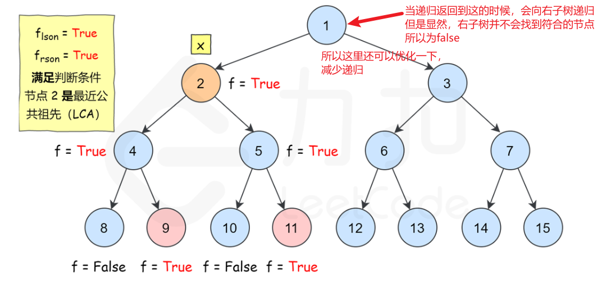

## [236. 二叉树的最近公共祖先](https://leetcode.cn/problems/lowest-common-ancestor-of-a-binary-tree/)


> 题目描述

给定一个二叉树, 找到该树中两个指定节点的最近公共祖先。

百度百科中最近公共祖先的定义为：“对于有根树 T 的两个节点 p、q，最近公共祖先表示为一个节点 x，满足 x 是 p、q 的祖先且 x 的深度尽可能大（一个节点也可以是它自己的祖先）。”

> 解题思路

- 使用dfs找到到达这两个节点的路径
- 找到两条路径中最近的共同节点，即靠后的

这里为了加快查找效率，将其中一条路径转化为set集合

```java
/**
 * Definition for a binary tree node.
 * public class TreeNode {
 *     int val;
 *     TreeNode left;
 *     TreeNode right;
 *     TreeNode(int x) { val = x; }
 * }
 */
class Solution {
    Map<TreeNode, List<TreeNode>> map = new HashMap<>();
    LinkedList<TreeNode> path = new LinkedList<>();

    public TreeNode lowestCommonAncestor(TreeNode root, TreeNode p, TreeNode q) {
        dfs(root, p, q, false, false);
        List<TreeNode> pPath = map.get(p);
        List<TreeNode> qPath = map.get(q);
        //查找两条路径中的最接近的共同节点
        //为了提高查找效率，将其中一条路径转化为Set存储
        Set<TreeNode> set = new HashSet<>(qPath);
        for(int i = pPath.size() - 1; i >= 0; i--){
            if(set.contains(pPath.get(i))){
                return pPath.get(i);
            }
        }
        return null;
    }
    public void dfs(TreeNode root, TreeNode p, TreeNode q, boolean foundP, boolean foundQ){
        if(root == null){
            return;
        }
        path.addLast(root);
        if(root == p){
            map.put(p, new LinkedList<>(path));
            foundP = true;
        }
        if(root == q){
            map.put(q, new LinkedList<>(path));
        }
        if(!foundP || !foundQ){
            dfs(root.left, p, q, foundP, foundQ);
        }
        if(!foundP || !foundQ){
            dfs(root.right, p, q, foundP, foundQ);
        }
        path.removeLast();
    }
}
```

递归。

设$f_{lson}\ and\ f_{rson}$表示为一个根节点的左子树和右子树是否包含目标节点。$x$ 表示为他们的最近公共祖先。

则对于x移动满足：

$f_{lson}\ and\ f_{rson}\ or\ ((x==q\ or\ x==p)\ and\ (f_{lson}\ or\ f_{rson}))$

上述的逻辑表达式可能看上去比较复杂。其实就是满足两个条件：

- 以该节点为根的树的左子树和右子树分别包含两个目标节点$(f_{lson}\ and\ f_{rson})$ 
- 或者当前节点表示其中一个节点，而另一个节点在其左子树或者右子树上

因此递归遍历二叉树，找到符合该条件的节点即为两个节点的最近公共祖先节点。

```java
class Solution {

    private TreeNode ans;

    public Solution() {
        this.ans = null;
    }

    private boolean dfs(TreeNode root, TreeNode p, TreeNode q) {
        if (root == null){
            return false;
        }
        
        boolean lson = dfs(root.left, p, q);
        boolean rson = dfs(root.right, p, q);
        
        if ((lson && rson) || ((root == p || root == q) && (lson || rson))) {
            ans = root;
        } 
        return lson || rson || (root == p || root == q);
    }

    public TreeNode lowestCommonAncestor(TreeNode root, TreeNode p, TreeNode q) {
        this.dfs(root, p, q);
        return this.ans;
    }
}
```

为啥确定找到的节点是深度最大的？



*********************

使用Map记录每个节点的父节点，算法步骤：

- 遍历二叉树，记录每个节点的父节点
- 从p开始，将父节点使用set记录visited节点
- 然后从q开始，找到第一个出现visited中的节点，即是我们要找的

```java
class Solution {
    Map<TreeNode, TreeNode> parent = new HashMap<TreeNode, TreeNode>();
    Set<TreeNode> visited = new HashSet<TreeNode>();

    public void dfs(TreeNode root) {
        if (root.left != null) {
            parent.put(root.left, root);
            dfs(root.left);
        }
        if (root.right != null) {
            parent.put(root.right, root);
            dfs(root.right);
        }
    }

    public TreeNode lowestCommonAncestor(TreeNode root, TreeNode p, TreeNode q) {
        dfs(root);
        while (p != null) {
            visited.add(p);
            p = parent.get(p);
        }
        while (q != null) {
            if (visited.contains(q)) {
                return q;
            }
            q = parent.get(q);
        }
        return null;
    }
}
```

