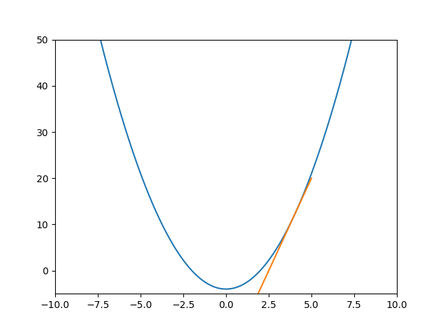

# [69. x 的平方根 ](https://leetcode.cn/problems/sqrtx/)

> 题目描述

给你一个非负整数 x ，计算并返回 x 的 算术平方根 。

由于返回类型是整数，结果只保留 整数部分 ，小数部分将被 舍去 。

注意：不允许使用任何内置指数函数和算符，例如 $pow(x, 0.5)$ 或者 $x ** 0.5$. 

> 解题思路

牛顿法是一种快速求解函数零点的方法，牛顿法的思想是利用泰勒级数无限逼近零点

设函数$f(x) = x^2 - C$该函数的零点即为C的平方根，当然这里只需要大于零的那个解。

以$f(x) = x^2 - 4$为例，该函数在$x = 4$的切线为$f(x) = 8x - 20$, 图像：



下一次选取切线与横轴的交点作为下一次的迭代初始点，当两次的初始点的距离在计算机中接近0时(一般是$10^{-7}$或者$10^{-8}$),则认为此时的截距即为零点。

```java
class Solution {
    public int mySqrt(int x) {
        if(x == 0){
            return 0;
        }
        double xi = x;
        double x0 = x;
        while(true){
            //斜率
            double k = 2*xi;
            //横轴截距作为下一次起始点
            xi = x0 - (x0*x0 - x)/k;
            if(Math.abs(xi - x0) < 1e-7){
                break;
            }
            x0 = xi;
        }
        return (int)xi;
    }
}
```

